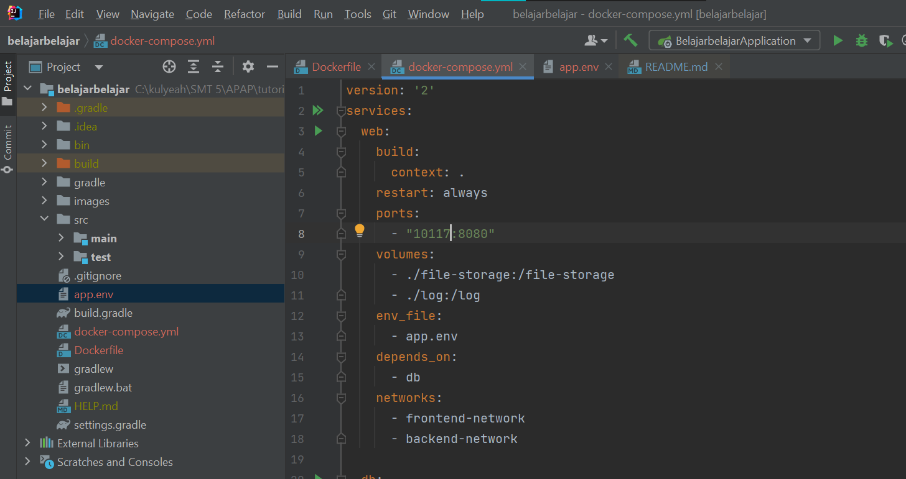

# Tutorial APAP
## Authors
* **Aurora Putri Kumala Bakti** - *2006597323* - *APAP A*

---
## Tutorial 8
### What I have learned today
### GitLab

1. Apa itu Dockerfile dan docker-compose.yaml? Apa fungsinya?
- Dockerfile, sebuah text sederhana yang digunakan untuk membangun sebuah Docker Image
  - digunakan untuk membuat image secara otomatis dengan membaca instruksi yang ada pada Dockerfile
- Docker compose digunakan oleh user untuk mendefinisikan sebuah atau beberapa services (website dan/atau database) yang nantinya akan digunakan untuk membentuk sebuah aplikasi dalam kesatuan. 
  - digunakan user untuk mempercepat dan mempermudah pembuatan service atau aplikasi pada sebuah containe
>https://belajarlinux.id/cara-menggunakan-Dockerfile/
>https://belajarlinux.id/menjalankan-project-sederhana-pada-docker/

2. Screenshot hasil perubahan anda. Setelah anda menyelesaikan tutorial ini, menurut anda, mengapa kita perlu mengganti port?

Kita perlu mengganti port karena web service yang kita gunakan menggunakan images yang terdefinisi pake doockerfile di direktori saat ini. Kemudian service tersebut akan mengaitkan container dan mesin host kepada port terbuka 10117 (nomor port saya). Service ini juga menggunakan default port untuk Flask web server 8080.
>https://docs.docker.com/compose/gettingstarted/

3. Mengapa terdapat versi dev dan prod? File apa yang menentukan konfigurasi mana yang dipakai? Apa yang harus dilakukan untuk menjalankan versi prod? (hint: baca file pada langkah 3 dengan teliti)
- Keduanya untuk membedakan environments yang dipakai. Menurut pegetahuan yang saya dapat, dev digunakan saat program masih dalam tahap proses dan prod merupakan saat program sudah dalam tahap final. 
- File yang menentukan konfigurasinya adalah filen app.env. 
- Untuk menjalankan versi prod, pada app.env tambahkan baris SPRING_PROFILES_ACTIVE=prod
>https://www.pagerduty.com/resources/learn/what-is-production-environment/
>https://docs.docker.com/develop/dev-best-practices/

4. Apa saja yang terjadi di langkah ini?
Pada langkah ini, docker melalukan inisiasi atau membuat dan mulai (create and start) sebuah container baru untuk tutorial apap khususnya belajarbelajar. Docker juga membuat sebuah database untuk project belajarbelajar.

5. Sertakan screenshot container yang sedang berjalan (versi gui atau cli, pilih salah satu). Apa itu docker container, images, dan volume?
 
- Docker container, sebuah environment virtual untuk aplikasi dapat berjalan di atasnya secara terisolasi.
- Docker images, sebuah file yang berisi source code, ibraries, dependencies, tools, dan file lainnya untuk aplikasi bisa berjalan. Sebuah container harus memiliki images untuk bisa bekerja.
- Docker volume, sebuah sistem file yang menyimpan data dari cointainer yang sedang berjalan (running).
>https://phoenixnap.com/kb/docker-image-vs-container
>https://phoenixnap.com/kb/docker-image-vs-container

6. Apa perbedaan docker-compose down dan stop?
- docker-compose down, memberhentikan kerja container sekaligus menghapus seluruh network dan data yang terbentuk
- docker-compose stop, memberhentikan kerja container tanpa menghapus data container

7. Sertakan screenshot mengakses laman kirti milik anda melalui browser (seperti screenshot di atas)


8. Ceritakan pengalaman anda melakukan deployment ke Kirti. Kendala apa yang anda alami?
Saat melakukan deployment dengan kirti, saya menemukan kejanggalan pada saat menjalankan docker-compose up -d. Saat itu, saya menjalankan apap-117.cs.ui.ac.id dan mendapatkan error 502 Bad Gateway. Namun, saat saya menjalakan docker-compose up saja, saya berhasil membuka halaman login pada web saya.

9. Buka container docker Anda, lalu screenshot. Apa perbedaan tampilan container sekarang dengan tampilan container pada langkah tutorial docker di awal tadi?
   
Perbedaanya adalah saat ini terdapat 3 container yaitu db-1, web-1, dan web2-1. web-1 sendiri memiliki port 10117 dan web2-1 memiliki port 10118. Hal ini terjadi karena kita menginisiasi file baru dan atribut baru untuk web2 pada docker.

10. Sertakan screenshot tampilan web ketika pertama kali menjalankan localhost:9090 dan tampilan web ketika halaman di-refresh.
- Pertama kali 
- Kedua kali (setelah refresh) 

11. Kendala apa yang anda hadapi ketika melakukan tutorial bagian nginx?
Saya mengalami kendala teknis dan beberapa percobaan saat menjalankan nginx serta mengubah isi configurasinya. Saat menaruh folder nginx pada program files, saya tidak bisa mengubah isi configurasinya sehingga saya mengalami beberapa kendala. Hal ini membuat saya mengubah lokasi folder nginx tersebut menjadi berada pada Desktop.

---
## Tutorial 7
### What I have learned today
### GitLab

1. Jelaskan secara singkat perbedaan Otentikasi dan Otorisasi! Di bagian mana (dalam kode yang telah anda buat) konsep tersebut diimplementasi?
Perbedaan otentikasi dan otorisasi berada pada tingkatannya. Suatu otentikasi berada pada halaman awal sekali suatu aplikasi yaitu misal memperiksa identitas orang untuk memberikan akses ke sistem. Sedangkan Otorisasi memberikan izin orang tersebut untuk mengakses fitur-fitur dalam aplikasi.
- Otentikasi,
```
@Autowired
    public void configAuthentication(AuthenticationManagerBuilder auth) throws Exception {
        auth.userDetailsService(userDetailsService).passwordEncoder(encoder());
    }
```
- Otorisasi,
```
    .antMatchers("/user/viewall").hasAuthority("Admin")
    .antMatchers("/user/add").hasAuthority("Admin")
    .antMatchers("/penyelenggara/add").hasAuthority("Manajer")
    .antMatchers("/login-sso", "/validate-ticket").permitAll()
```
>https://id.gadget-info.com/difference-between-authentication

2. Apa itu BCryptPasswordEncoder? Jelaskan secara singkat cara kerja dan tujuannya.
Merupakan implementasi dari PasswordEncoder yang menggunakan fungsi BCrypt strong hashing. 
Cara kerjanya,
 - Pertama, password diberi perlakuan "salted" yang artinya sebuah random sequence of characters di masukkan ke dalamnya. 
 - Kedua, password akan diberi perlakuan "hashed".
 - Ketigas, iterasi proses hashing akan terus berjalan hingga mencapai round spesifik yang disebut "cost factor".
Tujuannya adalah agar password tidak diketahui oleh siapapun kecuali user, bahkan tidak dengan pemilik website ataupun database.
>https://www.educative.io/answers/how-does-the-bcrypt-encoding-scheme-work-in-spring-security   

3. Apakah penyimpanan password sebaiknya menggunakan encryption atau hashing? Mengapa demikian?
Pada dasarnya, encryption merupakan fungsi dua arah yang mencakup enkripsi dan dekripsi sementara hashing adalah fungsi satu arah yang mengubah teks biasa menjadi intisari unik yang tidak dapat dipulihkan atau revert kembali.
Menurut saya untuk sebuah password akan lebih aman menggunakan hashing. Hal ini dikarenakan hashing tidak bisa di dekripsi seperti encryption. Untuk itu, encryption bisa digunakan untuk mengirim data dan sejenis daripada untuk menyimpan password.
>https://sslindonesia.com/perbedaan-hashing-dan-enkripsi-ssl-indonesia/
   
4. Jelaskan secara singkat apa itu UUID beserta penggunaannya!
UUID (Universal Unique Identifier) adalah 128-bit value yang digunakan untuk mengidentifikasi secara unik sebuah objek atau entity pada internet. UUID objek atau entity setiap kali program dijalankan akan memiliki nilai yang berbeda (baru). Pada kasus belajar-belajar penggunaan UUID berada pada model user. Jadi setiap user berhasil diinisaisi atau masuk ke dalam program, UUID akan di generate secara otomatis.
>https://www.techtarget.com/searchapparchitecture/definition/UUID-Universal-Unique-Identifier
>https://www.sinaungoding.com/yuk-belajar-web-menggunakan-spring-boot/

5. Apa kegunaan class UserDetailsServiceImpl.java? Mengapa harus ada class tersebut?
Class UserDetailsServiceImpl.java digunakan untuk mengambil data user pada database untuk kemudian dicari infromasi terkait otorisasinya di dalam sistem. Class tersebut harus ada karena informasi mengenai otorisasi user tidak akan terdaftar apabila class tersebut tidak ada sehingga program tidak dapat berjalan sesuai fungsinya.


---
## Tutorial 6
### What I have learned today
### GitLab

1. Perhatikan apa yang terjadi pada file index.html pada branch feat/tutorial-6-advancedgit-1. Apa yang terjadi setelah git cherry-pick dilakukan? Apakah kita bisa melakukan cherrypick tanpa harus melakukan commit?
Setelah melakukan git cherry-pick, isi dari index.html yang awalnya kosong pada branch feat/tutorial-6-advancedgit-1 menjadi terisi bagian head dan body seperti yang dimiliki file index.html pada branch tut6-for-cherrypick. Kita tidak bisa melakukan cherrypick tanpa melakukan commit. Hal tersebut dikarenakan git cherry-pick membutuhkan sebuah parameter untuk menjalankan fungsinya di mana parameter tersebut ialah kode yang tersimpan saat melakukan commit pada branch tut6-for-cherrypick. Untuk itu diperlukannya sebuah commit dari branch asal yang akan ditempelkan kepada branch tujuan menggunakan cherrypick.

2. Mengapa terjadi conflict?
Hal ini terjadi karena pada file index.html dalam branch feat/tutorial-6-advancedgit-1 dan branch tut6-for-merge memiliki data yang berbeda namun pada baris yang sama. Dengan demikian, git mendeteksi adanya tumpang tindih suatu data pada baris tertentu dan akan memberikan pilihan ke pada penggunanya untuk mengubah datanya menjadi data yang baru, menolak data baru, menerima kedua data, atau membandingkan masing-masing data. Selain memberikan pilihan, git juga akan menginfokan adanya conflict ini kepada user.

3. Apa yang terjadi pada log history setelah melakukan rebase (branch rebase-1 dan rebase-2)? Sertakan screenshot log history anda pada kedua branch tersebut!
Saya melakukan kegiatan rebase pada branch rebase-2 dan menggunakan command "git rebase rebase-1" dengan harapan semua commit yang dimiliki rebase-1 menjadi berada di bawah urutan commit miliki rebase-2. Terbukti saat saya menjalankan command tersebut, log berubah yaitu commit rebase-2 berada di atas atau setelah rebase-1. Berikut tampilan log pada rebase-1 dan rebase-2
- rebase-1

- rebase-2


4. Jelaskan perbedaan dari "rebase –continue", "rebase –skip", dan "rebase –abort"!
- rebase –continue, Kita bisa memilih opsi ini ketika sudah menyelesaikan atau menuntaskan conflict yang terjadi saat melakukan rebase.
- rebase –skip, Kita bisa memilih opsi ini ketika ingin menghiraukan atau membiarkan adanya conflict dan sistem git terus melanjutkan rebase.
- rebase –abort, Kita bisa memilih opsi ini ketika ingin memberhantikan kegiatan rebase pada git saat kita melihat adanya conflict dan kembali ke branch awal yaitu pada kasus ini adalah branch rebase-2.
>https://gitforteams.com/resources/rebasing.html

5. Jelaskan perbedaan git rebase dan git merge!
Perbedaan antara keduanya terletak pada perilaku yang mereka miliki. Merge akan melakukan penggabungan antara 2 branch yang ikut menggabungkan commitnnya namun urutannya akan ditentukan oleh git. Rebase melakukan penggabungan atau pengurutan urutan commit sesuai yang diinginkan user. 
>https://www.edureka.co/blog/git-rebase-vs-merge/

6. Pada tahap ini apakah yang terjadi pada direktori git-stash?
Pada kasus ini semua perubahan yang terjadi pada direktori git-stash akan di simpan dengan command git add namun akan hilang dan tersimpan oleh git saat melakukan command git stash. Kita selanjutnya bisa pindah ke branch yang seharusnya dan melakukan git statsh pop dan perubahan yang tersimpan saat melakukan git add tersebut akan disimpan pada branch yang baru dan kemudia bisa di commit seperti biasa. Dengan demikian, secara umum git stash melakukan fungsi yang sama seperti kita melakukan "cut".

7. Apa yang terjadi pada file abc.txt setelah melakukan git reset --hard? Bagaimana kondisi lognya? Apa perbedaan git reset dengan git revert?
Hal yang terjadi pada file abc.txt adalah baris kedua yaitu "this is second line from abc file" menjadi hilang karena kita  akan mengembalikan berkas atau file ke dalam keadaan commitednya. Kondisi lognya adalah semua commit setelahnya akan dihapus dan kita akan kembali ke keadaan spesifik commit yang diinginkan. Perbedaannya dengan git revert adalah, git akan mengembalikan file ke dalam bentuk commit yang diinginkan namun dengan cara membuat commit baru dan semua commit sebelumnya tidak akan hilang.
>https://www.depotkode.com/perbedaan-git-reset-checkout-dan-revert/
>https://initialcommit.com/blog/git-reset

## Tutorial 5
### What I have learned today
### GitLab

1. Apa itu Postman? Apa kegunaannya?
Postman merupakan sebuah aplikasi untuk melakukan API testing. Postman bisa menjadi wadah untuk kita yang melakukan pengecekan dan bertindak sebagai HTTP client yang melakukan HTTP request. Dengan Postman, kita diberikan berbagai kemudahan dan interface yang mudah dimengerti. Postman memiliki method, response codes, collections, environments, dan tester. Salah satu keunggulan Postman, mereka bisa melakukan Sharing Collection API for Documentation, Testing API, Realtime Collaboration Team, Monitoring API, Integration.
>https://www.encora.com/insights/what-is-postman-api-test
>https://medium.com/skyshidigital/documentation-testing-api-dengan-postman-part-1-5d33e430dca7

2. Jelaskan fungsi dari anotasi @JsonIgnoreProperties dan @JsonProperty.
Fungsi dari
- @JsonIgnoreProperties , yaitu untuk mengabaikan logical properties yang spesifik pada JSON serialization and deserialization. Dengan anotasi ini kita bisa mengabaikan properti JSON yang telah di tuliskan di dalamnya. Misal kita bisa mengabaikan properti "bookName" pada code di bawah. 
```
@JsonIgnoreProperties({ "bookName" })
public class Book {
   @JsonProperty("bookId")
   private String id;
	
   @JsonProperty("bookName")		
   private String name;
}
```

- @JsonProperty, terbalik dari @JsonIgnoreProperties yaitu untuk anotasi untuk mendefinisikan properti pada JSON serialization and deserialization. @JsonProperty dapat digunakan pada setter non-satis.

>https://www.concretepage.com/jackson-api/jackson-jsonignore-jsonignoreproperties-and-jsonignoretype

3. Apa kegunaan atribut WebClient?
WebClient biasa kita definikan pada implementasi dari service. Kegunaan atribut WebClient adalah untuk membantu kita mendapatkan dan mengirim data dari sebuah web atau URL.
>https://www.baeldung.com/webflux-webclient-parameters

4. Apa itu ResponseEntity dan BindingResult? Apa kegunaannya?
- ResponseEntity, adalah sebuah anotasi untuk mengisi hal yang ingin kita kembalikan saat melakukan sebuah mapping. ResponseEntity membantu kita merespon HTTP yang berisi header, isi, dan status. 
- BindingResult, adalah anotasi yang berisi kembalian dari sebuah post yang berisi pesan hasil validasi. Anotasi ini memiliki beberapa field di dalamnya dan bisa mengecek apakan pesan tersebut memiliki field error.


## Tutorial 4
### What I have learned today
### GitLab

1. Jelaskan perbedaan th:include dan th:replace!
- th:include, menambahkan sebuah fragment spesifik sebagai body dari host tag tersebut.
- th:replace, mengubah host tag ada saat itu dan mengubahnya dengan tag baru yang di-define pada baris replace tersebut. Hal ini menandakan host tag akan diubah dengan fragment tag yang spesifik.
Sehingga, keduanya memiliki perbedaan pada fungsinya di mana include berusaha menambahkan tag dan replace berusaha mengubah tag
>https://anshulgnit.blogspot.com/2018/05/difference-between-thymeleaf-attribute-replace-insert-and-include.html
>https://www.thymeleaf.org/doc/articles/layouts.html

2. Jelaskan apa fungsi dari th:object! 
Berdasarkan kasus BelajarBelajar ini, kita menggunakan th:object pada saat ingin menghapus sebuah pengajar pada sebuah course. Object yang di define disini adalah course dan th:object ini hadir setelah th:action. Hal ini menujukkan bahwa fungsi dari th:object yaitu sebagai atribut untuk menspesifikasi object yang ingin dihandle atau diberi suatu perintah. Saat kita men-define object ke dalam th:object dalam satu div, kita bisa melakukan pemanggilan atribut-atibut yang dimiliki object tanpa memanggil objectnya berkali-kali seperti

```
<div th:object = "${student}" class="box">
  <p><b>Full Name:</b> <span th:utext="*{fullName}"></span></p>
  <p><b>Email:</b> <span th:utext="*{id}"></span></p>
</div>
```

Hal ini sama saja dengan
```
<div class="box">
  <p><b>Full Name:</b> <span th:utext="${student.fullName}"></span></p>
  <p><b>Email:</b> <span th:utext="${student.id}"></span></p>
</div>
```
>https://www.baeldung.com/thymeleaf-in-spring-mvc
>https://o7planning.org/12385/thymeleaf-th-object-and-asterisk-syntax

3. Jelaskan perbedaan dari * dan $ pada saat penggunaan th:object! Kapan harus dipakai?
- Penggunaan *, biasa dilakukan saat memanggil atribut milik object setelah object-nya di define atau di nyatakan di awal
- Penggunaan $, biasa dilakukan saat object belum di define di awal sehingga perlu dipanggil bersamaan memangil atributnya. Biasanya atribut object yang dipanggil dengan $ merupakan atribut milik object yang dikirimkan oleh model.addAttribute dari method pada contorller yang memanggil html tersebut.

Dapat dilihat pada code diberikut,
```
<div th:object = "${student}" class="box">
  <p><b>Full Name:</b> <span th:utext="*{fullName}"></span></p>
  <p><b>Email:</b> <span th:utext="${student.id}"></span></p>
</div>
```

## Tutorial 3
### What I have learned today
### GitLab

1. Tolong jelaskan secara singkat apa kegunaan dari anotasi-anotasi yang ada pada model (@AllArgsConstructor, @NoArgsConstructor, @Setter, @Getter, @Entity, @Table)
__Anotasi:__
- @AllArgsConstructor, untuk men-generate constructor dengan 1 parameter pada setiap field yang ada di dalam kelas. Pada anotasi ini jika ditandai juga dengan anotasi @NonNull akan dilakukan pemeriksaan null pada tiap parameternya. 
- @NoArgsConstructor, untuk men-generate constructor tanpa parameter. Jika tidak berhasil akibat dari _final fields_ akan menghasilkan _compile error_.
- @Setter & @Getter, untuk men-generate setter dan getter otomatis pada class yang diinisiasi.
- @Entity, untuk melakukan konfigurasi sebuah class yang dinyatakan sebagai entitas dan akan di-map ke dalam tabel DB
- @Table, untuk menentukan nama tabel saat melakukan mapping ke dalam DB
> https://projectlombok.org/features/constructor
> https://spring.io/guides/gs/accessing-data-jpa/

2. Pada class CourseDb, terdapat method findByCodeUsingQuery dan findByCode, apakah perbedaan kedua method tersebut? Jelaskan juga kegunaan @Query pada method findByCodeUsingQuery!
Perbedaanya adalah findByCodeUsingQuery mengeksekusikan query sql langusng secara native dalam mencari course berdasarkan codenya sedangkan findByCode menggunakan pencarian course berdasarkan code secara otomatis pada DB. @Query sendiri merupakan sebuah notifikasi bahwa ada format sql yang akan dijalankan dalam DB.
>https://www.baeldung.com/spring-data-jpa-query

3. Jelaskan perbedaan kegunaan dari anotasi @JoinTable dan @JoinColumn
- @JoinTable, untuk menggabungkan 2 entitas pada 2 tabel menuju 1 tabel baru
- @JoinColumn, untuk menggabungkan kolom yang telah terhubung dengan entity yang sama pada kolom baru dalam 1 tabel

4. Pada class Pengajar, digunakan anotasi @JoinColumn pada atribut Course, apa kegunaan dari name, referencedColumnName, dan nullable dalam anotasi tersebut? dan apa perbedaan nullable dan penggunaan anotasi @NotNull
- name, menandakan sebuah nama kolom yang disebut sebagai foreign key
- referencedColumnName, menandakan sebuah nama kolom yang direferensi foreignkey
- nullable, menentukan apakah kolom foreign key tersebut bisa berisi null
- Perbedaan nullable dan @NotNull, yaitu nullable adalah anotasi yang menandakan bahwa field tersebut bisa berupa null dan tidak. Sedangkan, @NotNull adalah anotasi yang menandakan bahwa field tersebut tidak bisa berupa null

5. Jelaskan kegunaan FetchType.LAZY, CascadeType.ALL, dan FetchType.EAGER
- FetchType.LAZY, untuk melakukan query pada data berupa atribut spesifik ketika diinginkan atau dibutuhkan saja
- CascadeType.ALL, untuk melakukan operasi pada EntityManager yaitu seperti PERSIST, REMOVE, REFRESH, MERGE, dan DETACH
- FetchType.EAGER, untuk melakukan query pada data secara keseluruhan tak hanya pada data spesifik saja
>https://stackoverflow.com/questions/2990799/difference-between-fetchtype-lazy-and-eager-in-java-persistence-api


## Tutorial 2
### What I have learned today
### GitLab

1. Cobalah untuk menambahkan sebuah Course dengan mengakses link berikut: http://localhost:8080/course/add?code=APAP&nameCourse=APAP%20Tutorial2&description=2020%20Fasilkom&jumlahSks=3 Apa yang terjadi? Jelaskan mengapa hal tersebut dapat terjadi
Terjadi error. Error pada internal server error dengan kode status 500. Hal tersebut dikarenakan template atau html untuk link tersebut belum terdaftar sehingga saat controller memanggil tidak bisa atau terjadi error. Saya belum memeliki html yang dapat menampilkan request tersebut atau template dengan nama file html "add-course.html". 

2. Menurut kamu anotasi @Autowired pada class Controller tersebut merupakan implementasi dari konsep apa? Dan jelaskan secara singkat cara kerja @Autowired tersebut dalam konteks service dan controller yang telah kamu buat.
Menurut saya, anotasi tersebut (@Autowired) merupakan implementasi dari konsep injeksi suatu kacang ke kacang lainnya. Hal tersebut ditandai dengan penggunaan autowiring pada properti, setter, dan constructor. Dengan demikian, kita tidak perlu menulis kembali setter dan argumen pada constructor. Pada hal ini kita bisa lihat dalam courseService dimana mereka memiliki beberapa constructor yang sudah terinisiasi melalui autowired.
>https://www.tutorialspoint.com/spring/spring_autowired_annotation.htm

3. Cobalah untuk menambahkan sebuah Course dengan mengakses link berikut: http://localhost:8080/course/add?code=APAP&nameCourse=APAP%20Tutorial2&jumlahSks=3 Apa yang terjadi? Jelaskan mengapa hal tersebut dapat terjadi.
Terjadi error. Error pada server dengan kode status 400. Hal tersebut ditandai dengan kurangnya parameter yang dibutuhkan untuk bisa menjalankan method. Pada link yang diberikan terdapat parameter yang tertinggal yaitu parameter description. Semua parameter seperti code, nameCourse, description, dan sks di set "required = true" di mana hal tersebut membuat seluruh parameter harus terpenuhi sehingga tidak bisa dilempar dengan default null value.

4. Jika Papa APAP ingin melihat Course dengan kode APAP, link apa yang harus diakses?
Papa APAP bisa mengakses dengan kode link http://localhost:8090/course/view?code=APAP (*pada tugas ini saya menggunakan port 8090). Secara manual kita bisa melihat course APAP dengan link tersebut atau sesuai method yang dibentuk. Kita bisa menambahkan "?code=APAP" setelah http://localhost:8090/course/view? sesuai dengan request parameternya.

5. Tambahkan 1 contoh Course lainnya sesukamu. Lalu cobalah untuk mengakses http://localhost:8080/course/viewAll , apa yang akan ditampilkan? Sertakan juga bukti screenshotmu. 
Saya menambakan matakuliah dengan kode CRM, nameCourse Manajemen Hubungan Pelanggan, descriptipn 2022 Fasilkom, dan jumlahSks 3. http://localhost:8090/course/add?code=CRM&nameCourse=Manajemen%20Hubungan%20Pelanggan&description=2022%20Fasilkom&jumlahSks=3


## Tutorial 1
### What I have learned today
### GitLab
1. Apa itu Issue Tracker? Apa saja masalah yang dapat diselesaikan dengan Issue Tracker?
Issue Tracker adalah sebuah *tools* yang dihadirkan oleh GitLab yang membantu para usernya untuk berkolaborasi,merencanakan, dan berkreativitas dalam memecahkan masalahnya. Masalah yang dapat diselesaikan dengan Issue Tracker menurut saya adalah mereka bisa menjadi pengingat dan juga saluran informasi utama untuk mengetahui *progress* dari *project-project* yang sedang berjalan. 
>sumber: https://www.ibm.com/garage/method/practices/think/tool_github_issues/ 

2. Apa perbedaan dari git merge dan git merge --squash?
Keduanya sama-sama menggabungkan 2 *branch* menjadi 1. Perbedaannya terletak pada *commit*, merge --squash tidak memberikan *commit* apapun saat sebelum commit terjadi kepada main branch melainkan hanya akan menghasilkan sebuah *commit* akhir hasil dari *merging* tersebut. Untuk *merge* biasa, mereka akan memindahkan seluruh *history commit* yang sebelumnya telah terjadi pada masing-masing *branch* ke dalam *main* *branch*.Dengan *squashing*, kita dapat meminimalisir *commit* yang mungkin terbentuk.
>sumber: https://matt-rickard.com/squash-merge-or-rebase 

3. Apa keunggulan menggunakan Version Control System seperti Git dalam pengembangan suatu aplikasi?
Banyak sekali keunggulan yang dapat kita rasakan dengan menggunakan Git. Keunggulan tersebut diantaranya seperti kemudahan untuk melakukan *branching, reverting*, bekerja sama dengan tim (*distributed development*), melakukan pull ataupun push request dan tidak tabrakan dengan tim lainnya, dan masih banyak *control* lainnya yang dapat dimanfaatkan melalui Git. Hal ini tentunya sangat membantu setiap *developer* untuk mengembakan aplikasinya agar bisa berjalan dengan lancar dan memudahkan mereka untuk saling terintegrasi satu sama lain maupun individu dengan fitur-fitur aplikasinya. Version Control System ini juga memberikan keunggulan seperti melihat *commit* dan *log* dari suatu proyek yang tentunya dapat membantu *developer* melihat *history* dari status dan tahapan proyeknya.
>sumber: https://guide.quickscrum.com/git-guide/ https://www.atlassian.com/git/tutorials/why-git#:~:text=One%20of%20the%20biggest%20advantages,every%20change%20to%20your%20codebase. 

### Spring
4. Apa itu library & dependency?
Library merupakan sekumpulan kode dengan fungsi yang sama dan terkumpul dalam 1 modul. Library dapat digunakan berulang kali oleh pengguna dengan cara melakukan *import*. 
Dependency sendiri merupakan sebutan atau istilah untuk kode yang bergantung pada kode lainnya. 
>sumber: https://medium.com/swlh/what-is-the-difference-between-a-module-a-package-a-library-and-a-dependency-b09ca8e83ce7

5. Apa itu Gradle? Mengapa kita menggunakan Gradle? Apakah ada alternatif dari Gradle?
Gradle merupakan sebuah program yang melakukan *build* secara otomatis. *Build* tersebut dapat berupa *compile* dan *packaging*. Hal tersebut dapat dilakukan gradle secara otomatis dengan diperintahkannya gradle. Kita Menggunakan gradle karena mereka dapat membantu kita untuk menjalankan program lebih cepat dan otomatis. Misal, saat terdapat banyak *file* java kita tidak mungkin men-*compile*-nya satu persatu. Hampir seluruh IDE sudah terkoneksi dengan gradle. Alternatif dari gradle adalah CMake, GNU Make, SCons, Maven, dan Meson.
>sumber: https://www.petanikode.com/java-gradle/ https://alternativeto.net/software/gradle/

6. Selain untuk pengembangan web, apa saja yang bisa dikembangkan dengan Spring framework?
Banyak sekali produk yang dalam dikembangkan dengan Spring Framework. Produk tersebut cenderung berjenis keamanan atau jasa bagi sebuah perusahaan. Spring Framework juga bisa mengembangkan sebuah *mobile app* utamanya pada Android Environment. 
>sumber: https://spring.io/blog/2010/11/20/spring-into-mobile-application-development https://socs.binus.ac.id/2017/10/04/framework-spring-java/ 

7. Apa perbedaan dari @RequestParam dan @PathVariable? Kapan sebaiknya menggunakan @RequestParam atau @PathVariable?
Keduanya sama-sama membantu mendapatkan data dari link URL dan URI dan mengelolanya pada bagian controller. Perbedaannya terletak pada @RequestParam mengambil query parameters sedangkan @PathVariable mengambil data atau nilai yang nantinya akan di ekstrak dari URI. 
@RequestParam cocok digunakan untuk web yang masih tradisional sedangkan @PathVariable cocok untuk web yang RESTful di mana URL-nya biasanya berisi angka-angka yang unik seperti ISBN dan lainnya.
>sumber: https://javarevisited.blogspot.com/2017/10/differences-between-requestparam-and-pathvariable-annotations-spring-mvc.html#axzz7eDMYtTUS

### What I did not understand
- [x] Kenapa saya harus belajar APAP?
> Karena APAP membuat saya menjadi lebih memahami dasar arsitektur atau mungkin layer dalam sebuah aplikasi. Hal ini sangat bermanfaat terlebih lagi saya merupakan mahasiswa CS
- [] Saya masih belum paham betul elemen-elemen di dalam spring
